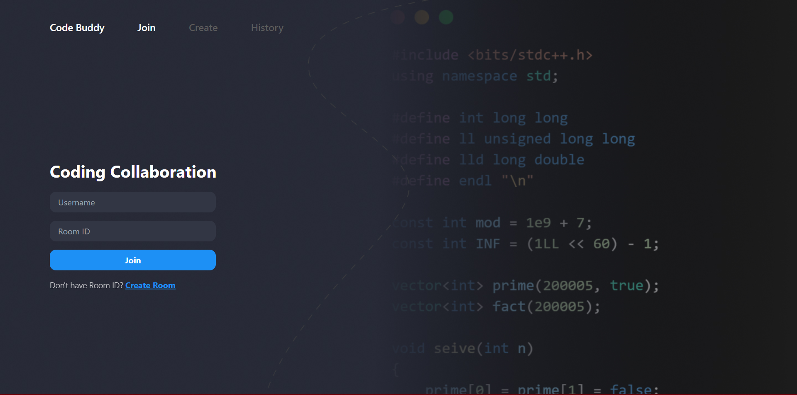
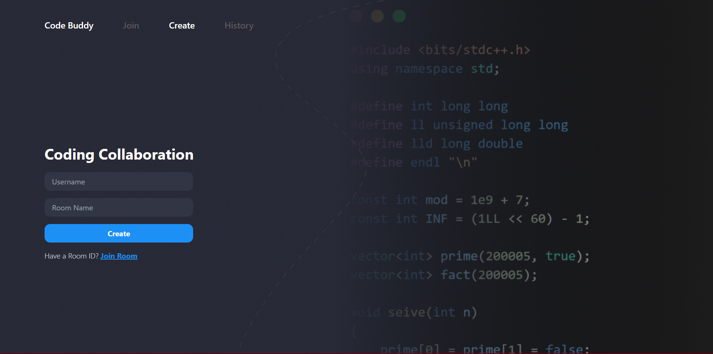
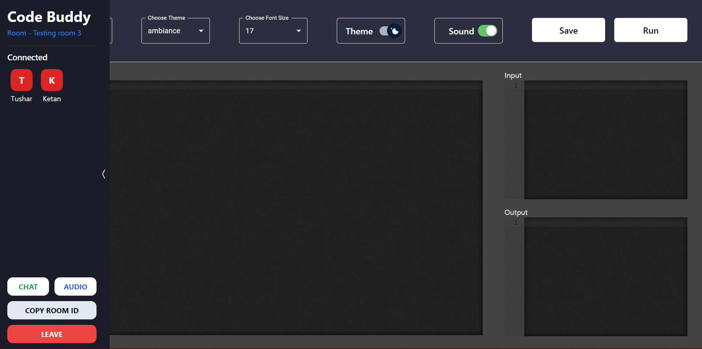
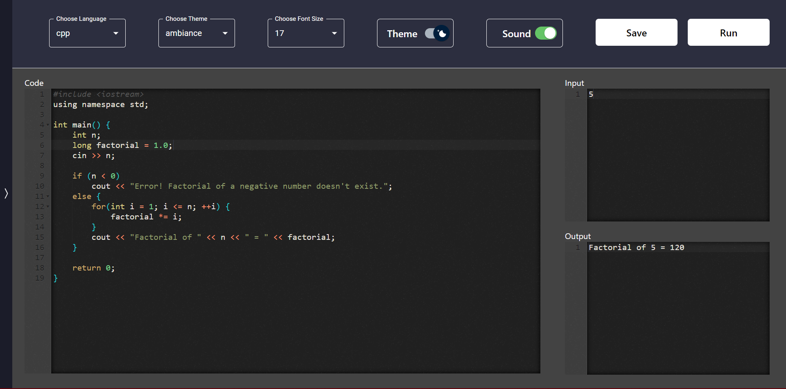
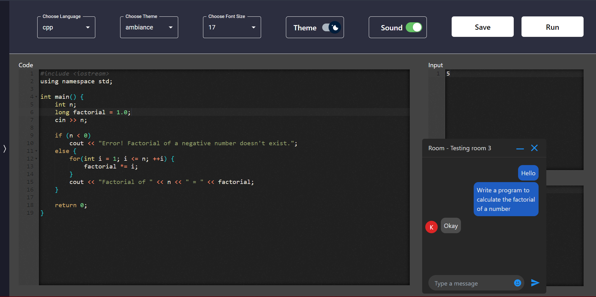

# Chat Buddy

Chat Buddy is a web based Mern application which provides a platform to code with anyone in realtime.

# TechStack

1. Reactjs
2. Tailwind CSS
3. NodeJs
4. MongoDB
5. Socket.io

# Summary

1. Modeled the frontend with ReactJs and used Tailwindcs and MaterialUI to create clean and responsive UI
2. Enabled Room system using Socket.io and MongoDb to join any room using a Unique Room ID.
3. Used Ace Editor for writing code in different langauges and with different themes and Paiza.io service for running and compiling the code.
4. Enabled live coding and live chat in the room using Socket.io

# Screens

1. Home Page
   - Entering Username and Room ID to join a particular room.
   - Creating new room by entering username and room name.
   - Entering previously joined rooms saved in your browser history.
2. Room Page
   - Sidebar: It shows the name of all those present the room. A user can logout by clicking on the Log out button present at the bottom and they can copy the Room ID by clicking on the copy room id button. A Chat button is also present which opens a small window for group chat.
   - Header: A user can change the theme, font-size, dark/light mode and the programming language. Also, the user can run or save code by clicking on Run and Save button respectively
   - Body: The body is further divided into 4 sections:
     * Code Editor: Here the user writes the code in their selected programming language.
     * Input box: Here the user enters the input for the written code.
     * Output box: The output after running the code is displayed here.
   - Chat box: All the users present in a room can chat by clicking on the chat button.

# Features to be added later in the future
1. Enabling realtime voice chat to overcome effective communication.
2. Enabling realtime video conferencing for better understanding while coding.

# Preview

